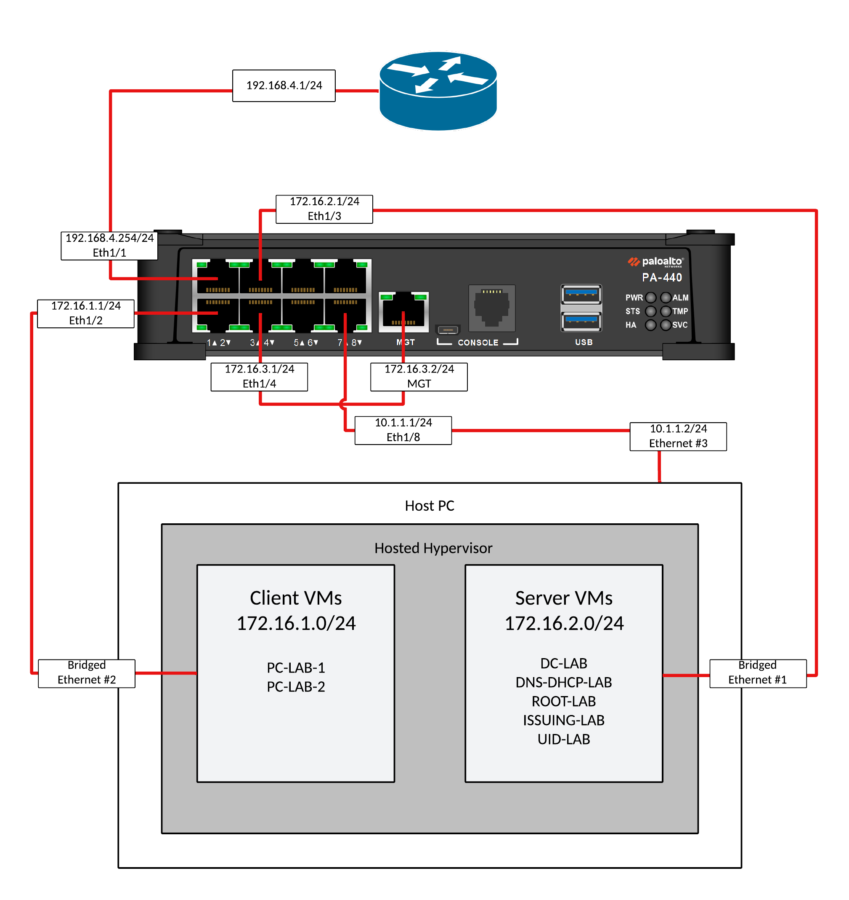

# Virtual Active Directory and Palo Alto NGFW Lab

## Lab Goals
- Deploy **Active Directory** environment.
- Segment an enterprise network into **Clients, Servers, and Management** zones using a **Palo Alto PA-440 NGFW**.
- Deploy a **two-tier PKI** (Root CA + Issuing CA) to support **SSL/TLS decryption** on the firewall.
- Integrate **Active Directory** and **User-ID Agent** to enforce identity-based security policies.
- Validate security controls across network.
---
## Overview
This project simulates a virtual Active Directory network segmented and secured by a **Palo Alto PA-440 Next-Generation Firewall (NGFW)**.

The firewall will be used to segment the enterprise into three separate networks:
- **Clients** - Domain-joined Workstations
- **Servers** - Domain Controller, DNS/DHCP Servers, Root CA, Issuing CA, User-ID Agent
- **Management** - Administrative access for firewall management

Security policies will be implemented using **User-ID**, where access controls are based on Active Directory users and groups rather than just IP addresses. Additionally, a **two-tier PKI** (Root CA + Issuing CA) will be deployed to enable **SSL/TLS decryption** on the firewall, allowing inspection of encrypted traffic while maintaining secure communications.

This lab demonstrates how NGFWs, directory services, and PKI can work together to provide **identity-based, encrypted traffic-aware security** in a segmented enterprise environment.

---
## Lab Topology

### Network Topology

### IP Address Plan
| Device                 | Zone          | IP Address    | Notes                      |
| ---------------------- | ------------- | ------------- | -------------------------- |
| Domain Controller (DC) | Servers       | 172.16.2.2/24 | AD Server                  |
| DNS/DHCP               | Servers       | 172.16.2.3/24 | DNS, DHCP servers          |
| Root CA                | Servers       | 172.16.2.4/24 | Offline Root CA            |
| Issuing CA             | Servers       | 172.16.2.5/24 | Online Issuing CA          |
| User-ID Agent          | Servers       | 172.16.2.6/24 | AD User IP Mapping         |
| Client-1               | Clients       | DHCP          | Domain-joined              |
| Client-2               | Clients       | DHCP          | Domain-joined              |
| PA-440 MGMT            | Management    | 172.16.3.2/24 | Firewall admin interface   |
| Host PC                | Configuration | 10.1.1.2/24   | Firewall management access |

---
## Prerequisites
- VMware Workstation Pro installed
- PuTTY Installed (or your preferred terminal emulator/serial console)
- ISO images: Windows Server 2025, Windows 11 Enterprise  
- Palo Alto PA-440 NGFW (Factory Reset)
- 3 Additional Ethernet interfaces (not including integrated Ethernet port)
---
## Step-by-Step Lab Guide
### [0. Pre-lab Setup](project-files/pre-lab-setup.md)
##### [Host PC Ethernet Configuration](project-files/pre-lab-setup.md#host-pc-ethernet-configuration)
##### [Workstation Configuration](project-files/pre-lab-setup.md#workstation-configuration)
### 1. Configure Interfaces on NGFW (via CLI)
### 2. Complete Network Configuration for NGFW (via GUI)
### 3. Configure Policies on NGFW (via GUI)
### 4. Deploy and Configure Domain Controller
##### Initial Configuration
##### Active Directory Domain Services Configuration
##### Users and Groups Creation
##### Group Policy Configuration
##### DNS Configuration
### 5. Deploy and Configure DNS and DHCP Server
##### Initial Configuration
##### DNS and DHCP Installation
##### DHCP Configuration
##### DNS Configuration
### 6. Deploy Two-Tier PKI
##### ROOT-LAB
##### ISSUING-LAB
##### DC-LAB
### 7. Create New Policies, DHCP Relay, and Administrators (via NGFW GUI)
##### Create New Security Policies
##### Configure DHCP Relay
##### Add Administrators to Firewall
### 8. Domain Join Clients and Configure Decryption
##### Domain Join
##### Create Certificates for Decryption
##### Create Decryption Policies
##### Verify Traffic Decryption
### 9. Deploy Windows User-ID Agent
##### UID-LAB
##### NGFW GUI
### 10. Configure Identity-Based Firewall Policies
## Summary
