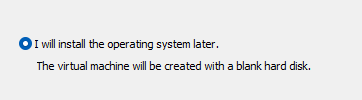

### 0. Pre-lab Setup
##### Host PC Ethernet Configuration
1. *Optional, but recommended:* **Disable IPv4 and IPv6** on Network Adapters that will be used for Bridge Adapters.
	- On Host PC, navigate to: **Control Panel** > **Network and Internet** > **Network Connections** > Right-Click and Select **Properties** for adapter that will be a **Bridged Adapter**.
	
		
2. **Set Static IP for Ethernet Adapter** that will connect to eth1/8 on NGFW.
	- On Host PC, navigate to: **Control Panel** > **Network and Internet** > **Network Connections** > Right-Click and Select **Properties** for adapter that will be used for **Firewall Configuration**.
	- Select **IPv4** > **Properties** > Use the following:
		- IP: 10.1.1.2
		- Subnet Mask: 255.255.255.0
		- Default Gateway: 10.1.1.1
		- DNS can be left blank.
		
		
##### Workstation Configuration
1. **Create Custom Network Adaptor** for Bridged Adapters on VMWare Workstation
	- Select VMWare Workstation, navigate to: **Edit** > **Virtual Network Editor** > **Change Settings** > **Add Network** > Select any virtual network > **Bridged** > Choose Adapter that was previously configured
	
		
	- Ensure that you ceate two virtual networks for **Client VMs** and **Server VMs**.
	
		
2. **Create VMs** and install Windows Server 2025/Windows 11 Enterprise for all servers and clients.
	- File > New Virtual Machine *or* Crtl+N
	
		
	- Select "Install OS Later"
	
		

   - Choose the OS Version: Windows 11 or Server 2025
	
		

   - Name your VM and select storage location.

	   	
	- Select disk capacity (I left as default).

	   	
	- Click on **Customize Hardware** > **New CD/DVD** > **Use ISO Image File** > Select OS ISO

		
	- Change **Network Adapter** then **Close** and **Finish**

		
	
	**End Result**

	
	- Ensure that network adapters are assigned to correct VMs:
		- **Clients** → VMnet1
		- **Servers** → VMnet2
