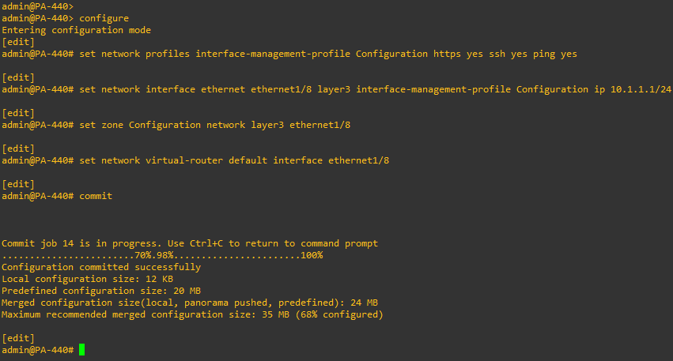
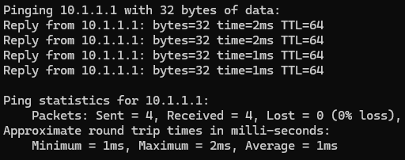
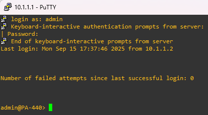
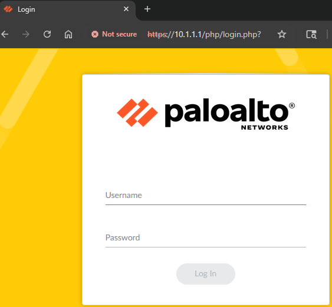

### 1. Configure Interfaces on NGFW (via CLI)
We’ll configure an interface that allows GUI access to the firewall using our **host PC**. This is necessary because the **MGT** interface is reserved for enterprise network integration.
1. **Console into the firewall** with default credentials: 
	Username: `admin`
	Password: `admin`

	*Note: You will be prompted to change the default password.*
2. **Disable Zero Touch Provisioning (ZTP)** (if enabled)
	- If enabled, a reboot will be required which will reset credentials to default.
		admin@firewall> `set system ztp disable`
3. **Enter configuration mode**:
		admin@firewall> `configure`
	
	*Note: The '>' will change to a '#' once in configuration mode.*
4. **Create an interface management profile**:
		admin@firewall# `set network profiles interface-management-profile Configuration https yes ssh yes ping yes`

	*Note: This profile is what will allow us to reach the management GUI through the interface.*
5. **Configure interface**:
	`ethernet1/8` → 10.1.1.1/24
		admin@firewall# `set network interface ethernet <interface> layer3 interface-management-profile Configuration ip <ip>/<netmask>`
6. **Create and apply security zone**:
	admin@firewall# `set zone <zone-name> network layer3 <interface>`
7. **Attach interface to a virtual router**:
	admin@firewall# `set network virtual-router <router-name> interface <interface>`
8. **Commit configuration**:
	admin@firewall# `commit`
	
	
9. **Verify connectivity from host PC.**
	- Ping, SSH, and use a web browser to navigate to the interface IP.

		*Note: On the web browser, you'll need to navigate to https://<IP\>*
	
		
	
		
	
		

---
### Next Part: [2. Complete Network Configuration for NGFW (via GUI)](../2-complete-network-config-ngfw/README.md)
### Previous Part: [0. Pre-lab Setup](../0-pre-lab-set-up/README.md)
