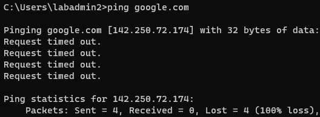

### 10. Configure Identity-Based Firewall Policies
1. Pull **Groups** from Active Directory.
	- Navigate to: **Device** > **User Identification** > **Group Map Settings** > **Add**
	- Configure the following:
		- Name: ad-groups
		- Server Profile Tab:

			
		- Group Include List: Open Domain dropdown and add **Lab Groups**

			
		- **OK** and **Commit**
2. Update **Security Policies** with **Users/Groups**:
	- Update **Clients to Servers and Management** rule
		1. Clone the rule and add it after the rule.

			
		2. Rename the original rule to **Clients to Servers** and rename clone to **Clients to Management**.

			
		3. Change the **Source User** for each rule.
			- **Clients to Servers** > Add **Server Admin**

			
			- **Clients to Management** > Add **Firewall Admin**

			
		4. Remove **Destination** that does not match rule.
			- **Clients to Servers** > Remove **Management**
			- **Clients to Management** > Remove **Servers**
		5. Verify rules are properly updated.

			
	- Update **Clients and Servers to External** rule
		1. Clone the rule twice.

			
		2. Rename the rules:
			- **Block Restricted Clients to External**
			- **Allow Clients to External**
			- **Allow Servers to External**

			
		3. Set the **Source** for the following rules:
			- **Block Restricted Clients to External** > Zone: **Clients**, User: **restricted user**
			- **Allow Clients to External** > Zone: **Clients**, User: **non-restrict user**
			- **Allow Servers to External** > Zone: **Servers**, User: **any**

			
		4. Set the **Destination** for the following rules:
			- **Block Restricted Clients to External** > Zone: **External**
			- **Allow Clients to External** > Zone: **External**
			- **Allow Servers to External** > Zone: **External**

			
		5. Set the **Action** for the following rules:
			- **Block Restricted Clients to External** > Action: **Deny**
			- **Allow Clients to External** > Action: **Allow**
			- **Allow Servers to External** > Action: **Allow**

			
3. Create **Security Policy** for **Clients** to **Servers** with applications to reach **Active Directory services.**
	- **Add**
	- Name: **Clients to AD Services**
	- Source: **Clients** zone
	- Destination: **Servers** zone
	- Applications: active-directory, dhcp, dns, kerberos, ldap, ms-ds-smb, ms-netlogon, msrpc, ntp, ssl, web-browsing, webdav
	- Everything else: default
	- **OK** > Move rule to **top**

	
4. Ensure all rules are in the correct order.

	
	- **Commit**
5. Validate policies by logging in as different AD users on **Client PCs**.

	Recall the groups our lab users and admins were in.

		labadmin1 - Server Admin

		labadmin2 - Firewall Admin

		labuser1 - Non-restricted User

		labuser2 - Restricted User
	- As **labadmin1**, ping **Servers**, **Firewall**, and external address, such as google.com

		

		

		

		Since there is no explicit rule allowing **administrators** to **external**, traffic is implicitly **denied**.
	- As **labadmin2**, ping **Servers**, **Firewall**, and external address

		

		

		
	- As **labuser1**, ping **Servers**, **Firewall**, and external address

		

		

		
	- As **labuser2**, ping **Servers**, **Firewall**, and external address

		

		

		
