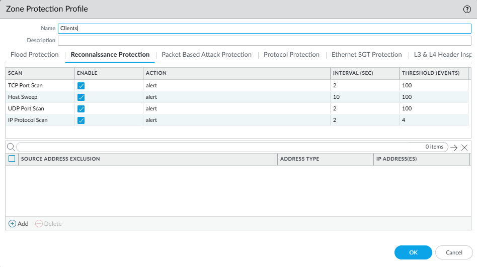
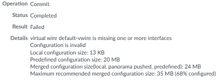
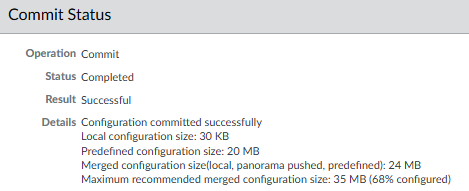

### 2. Complete Network Configuration for NGFW (via GUI)
1. From your **Host PC**, browse to `https://10.1.1.1`
2. **Log in via GUI** with administrator credentials.
	
	
3. **Configure MGT Interface**
	- Navigate to: **Device** > **Setup** > **Management** > **Interface** >**Management**
	- Change the following :
		- IP Address
		- Netmask
		- Default Gateway
		
		
4. **Configure DNS Server.**
	- Navigate to: **Device** > **Setup** > **Services**
		- Primary DNS: 8.8.8.8
		- Secondary DNS: 8.8.4.4
		
		

	*Note: We'll be changing the DNS server later to the Domain Controller IP. We need to configure the DNS now to pull down licenses and certificates.*
5. **Create zone protection profile.**
	- Navigate to: **Network** > **Network Profiles** > **Zone Protection**
		- Set the following for zones: **Clients**, **Servers**, **Management**, **External**

			

			*Note: Alarm Rates can be adjusted later once you're able to get your average Connections per second (CPS).*

			

			

			

		*Note: There are other options that can be configured, but I did not configure them.*
6. **Create security zones.**
	- Navigate to: **Network** > **Zone** > **Add**
	- Create **External**, **Servers**, **Client**, and **Management** zones.
	- Apply corresponding **Zone Protection Profile**.
	
		*Note: **trust** and **untrust** zones are created by default.*

		
	
	*Note: **User Identification** will be enabled for **Client** zone.*
	
	*Note: Interfaces will be auto populated when we create each interface.*
7. **Create Interface Management profiles.**
	- Navigate to: **Network** > **Network Profiles** > **Interface Mgmt**
	- Create **External**, **Servers**, **Client**, and **Management** profiles.

		

	   *Note: **User-ID** and **Response Pages** will only be check for **Clients**. **Servers**, **Management**, and **Clients** will have **Ping** enabled.*

	**End Result**

	
9. **Create Ethernet Interfaces.**
	Navigate to: **Network** > **Interfaces** > **Ethernet**
	- Configure **ethernet1/1** as **layer 3** **External** interface.

		
	
		

   		*Note: We won't be configuring IPv6 or SD-WAN.*

		
		- Configure **ethernet1/2** for Clients (172.16.1.1/24).
		- Configure **ethernet1/3** for Servers (172.16.2.1/24)
		- Configure **ethernet1/4** for Management (172.16.3.1/24)

	**End Result**

	
10. **Commit Configuration.**
	- On the top right of the GUI, click **Commit**

		
	- Select **Commit All Changes**

		
11. ***If necessary*, Troubleshooting Commit Issues**
	- If you receive the following error when committing configuration:

		
	- Complete the following:
		- Navigate to: **Network** > **Virtual Wires**
			Select **default-vwire** and **delete**
		- **Commit** configuration again.

			
12. **Configure Default Route.**
	- Navigate to: **Network** > **Virtual Routers** > **default** > **Static Routes**

	
	- **Commit**

---
### Next Part: [3. Configure Policies on NGFW (via GUI)](../3-configure-policies-ngfw/README.md)
### Previous Part: [1. Configure Interfaces on NGFW (via CLI)](../1-configure-interfaces-on-ngfw/README.md)
