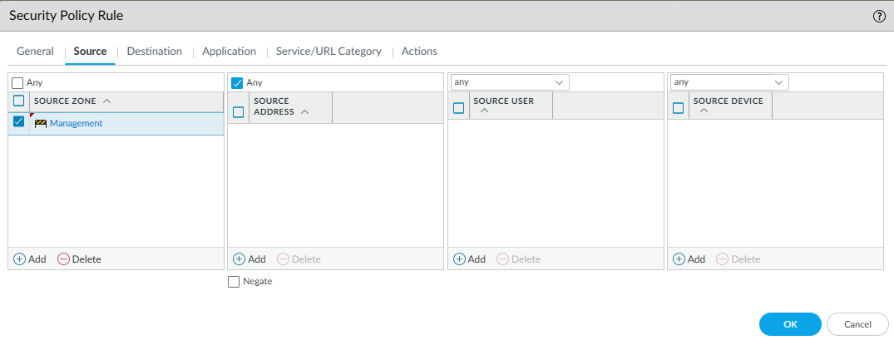

### 3. Configure Policies on NGFW (via GUI)
1. **Create a NAT policy**
	- Navigate to: **Policies** > **NAT** > **Add**

		*Note: Without a NAT policy, all clients **cannot** reach the internet.*
	- Name

		
	- Add **source** and **destination**

		
	- Add **source address translation**

		
	- **OK**
2. **Create a security policy** for the **Management** zone
	The security policy that we will be creating is to allow the **Management** interface to reach Palo Alto Networks servers.
	- Navigate to: **Policies** > **Security** > **Add**
	- Name

		
	- Select **Source Zone** (*Optional*: Set source address to Management IP space)

		
	- Select **Destination Zone**

		
	- Leave **Applications** as **Any**

		
	- Leave **Service** and **URL Category** as **default**.

		
	- Set **Action** and **Profile** settings

		
	- **OK** and **Commit**
3. **Validate Policies**
	- If the firewall was able to fetch a **device certificate**, then the configured policies worked as intended.
		- To verify, go to **Tasks** on bottom right and look for the following task:

			
	- You can also attempt to retrieve licenses from license server:
		- Navigate to: **Device** > **Licenses** > **Retrieve License Keys from License Server** (No Licenses should be present prior to this)
		- After license retrieval, all your subscriptions should be present:

			
4. *Optional, but **Recommended***: **Configure Dynamic Updates**
	Now that we have our policies in place, the firewall should have no issues pulling down updates, but we need to tell the firewall to download and install updates.
	- Navigate to: **Device** > **Dynamic Updates**
		- Set a **schedule** for **Antivirus** updates.

			
		- Set a **schedule** for **Applications and Threats** updates.

			

			*Note: It's recommended to test new apps before pushing them to a live environment, but this is a lab so we're going to download and install.*
		- Set a schedule for **WildFire** updates.

			

**Configured Schedule**

