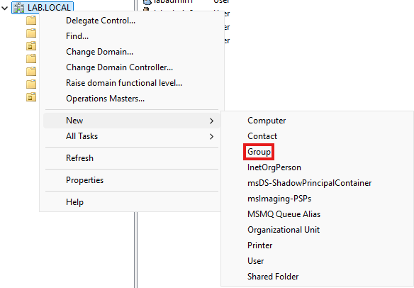
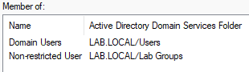
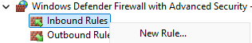
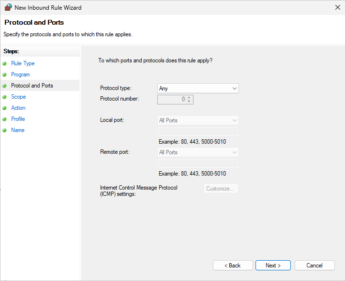
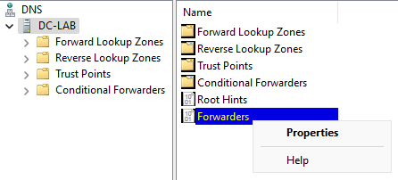

### 4. Deploy and Configure Domain Controller

*Note: Ensure that Windows Server 2025 is fully installed on VM, including VMWare Tools.*
##### Initial Configuration
1. Configure **static IP** and **DNS server** in Servers (172.16.2.0/24) subnet.

	*Note: Reference IP Address Plan*
	
	
2. Ensure that you can reach the **Servers gateway** on the **Firewall**.
	
	*Note: We did not need to configure a rule for this because intrazone sessions are allowed by default.*
	
	
3. Change **computer name** then **Restart**.
	
	

##### Active Directory Domain Services Configuration

1. Navigate to: **Server Manager** > **Manage** > **Add Roles and Features** > Complete the Wizard
	
	

2.  Select **Role-based or feature-based installation**.
	
	
3. Select **DC-LAB** to install roles and features.
	
	
4. Select Server Roles > **Active Directory Domain Services** > Check **Include management tools**.
	
	
	
	
5. Leave **Features** as default > Next
6. On AD DS page > Next
7. **Install**
8. Promote the server to **Domain Controller**.

	
9. **Add a new forest** and create a **Root domain name** > Next

	
10. Create **Domain Services Restore Mode (DSRM) password** > Next
	
	
11. Leave **DNS Options** as default > Next
12. Leave **Additional Options** as default > Next
13. Leave **Paths** as default > Next
14. **Review** your selections > Next
15. After **Prerequisites Check** is complete > Install > Server will restart once installation is complete.
	
	
16. Log back in after restart.

##### Users and Groups Creation
1. Create new **Organization Unit (OU)** for **Lab Users**.
	- Open **Active Directory Users and Computers**.
	
	
	- Right-click your domain > New > Organizational Unit > Name > OK

		

		
2. Create new **Users**.
	- Right-Click **Lab Users** > **New** > **User**
	
	

	

	
	- **Users** to create.
		- labadmin1
		- labadmin2
		- labuser1
		- labuser2
		- paloaltoservice

    		*Note: We're creating this account ahead of time for two reasons: we will be using this account to configure **Administrators** for the firewall and we will also be using it to setup **User-ID**.*
3. Create new **OU** for **Lab Groups**.
	- Right-click your domain > **New** > **Organizational Unit** > **Name** > **OK**

		
	
		
4. Create new **Groups** within **Lab Groups** OU.
	- Right-click your group OU > **New** > **Group** > **Group Name** > **OK**

		
	
		
	- Create the following **Groups**:
		- Firewall Admin
		- Server Admin
		- Restricted User
		- Non-restricted User
5. Add **Users** to **Groups**
	- Navigate to: **Lab Users** OU > Right-Click a user > **Properties** > **Member Of**

   		
	- Enter Object (Group) Name > **Check Names** > Group Name should auto-populate

   		
	- Add **Groups** to following **Users**:
		- labadmin1 - Domain Admins, Server Admin

			
		- labadmin2 - Domain Admins, Firewall Admin

			
		- labuser1 - Non-restricted User

			
		- labuser2 - Restricted User

			
		- paloaltoservice - Administrators, Event Log Readers, Server Operators

			

##### Group Policy Configuration
1. Open **Group Policy Management Console**

	
2. Create a **Group Policy Object (GPO)**.
	- Expand Forest > Domains

		
	- Right-Click LAB.LOCAL (or your domain) > Select **Create a GPO in this domain, and Link it here...**
	- Name your new GPO

   		
3. Edit your new **GPO**
	- Right-Click the GPO > **Edit**
	- Navigate to: **Computer Configuration** > **Policies** > **Windows Settings** > **Security Settings** > **Windows Defender Firewall with Advanced Security**

   		
	
	- On Right-hand window > Select **Windows Defender Firewall Properties** > **Enable** Domain, Private, and Public Firewall

   		

	- In **Policy Path**, Right-click **Inbound Rules** > **New Rule**

		

	- Configure the following rule to allow inbound connections from network (172.16.0.0/16) > Finish.

		

		

   		

   		

   		

   		

   		

##### DNS Configuration
1. Open **DNS**.	

	
2. Expand Path > Right-Click **Forwarders** > **Properties** > **Edit**

	
3. Add **DNS-DHCP-LAB** IP from IP Address Plan.

	*Note: The server FQDN will not resolve until we deploy the server and join it to the domain.*

	

