### 5. Deploy and Configure DNS and DHCP Server
##### Initial Configuration
1. Configure **static IP** and **DNS server** in Servers (172.16.2.0/24) subnet.

	*Note: Reference IP Address Plan - DNS-DHCP-LAB*
	- IP Address: 172.16.2.3
	- Subnet Mask: 255.255.255.0
	- Default Gateway: 172.16.2.1
	- DNS Server: 172.16.2.2
2. Ensure that you can reach the **Servers gateway** on the **Firewall**.

	*Note: We did not need to configure a security rule on the Palo Alto Firewall for this because intrazone (within the same network) sessions are allowed by default.*

	

	We can also try to ping the **Domain Controller**

	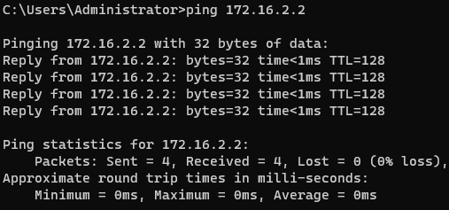
3. Change **computer name** and **join LAB.LOCAL domain**, use **labadmin** credentials when prompted, then **Restart**.

	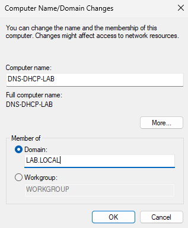

	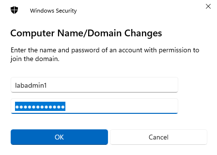

	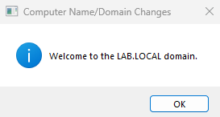
4. **Log in** with either **Lab Admin** user account.

	*Note: Notice how we are now signing in through the domain.*

	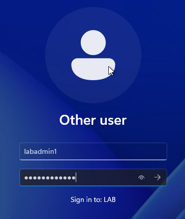

##### DNS and DHCP Installation
1.  Navigate to **Server Manager** > **Manage** > **Add Roles and Features** > Complete the Wizard
2. Select **Role-base or feature-based installation**

	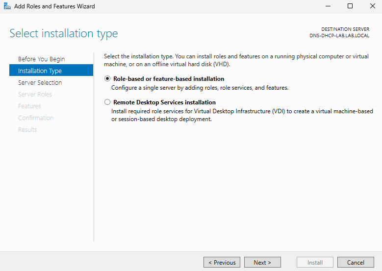
3. Select **DNS-DHCP-LAB** to install roles and features.

	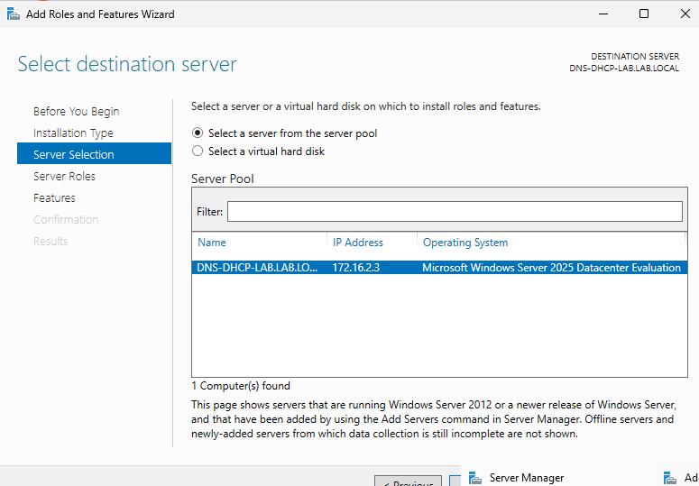
4. Select Server Roles > **DHCP Server** and **DNS Server** > Check **Include management tools**.

	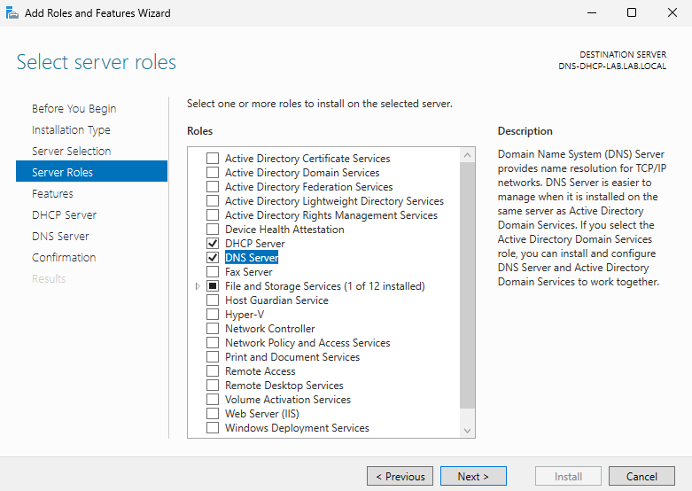

	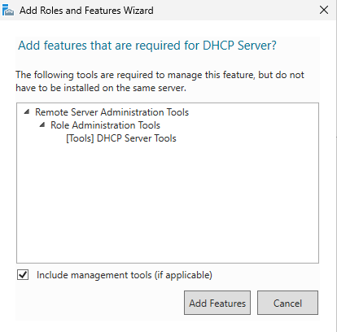

	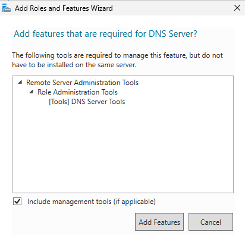
5. Leave **Features** as default > Next
6. DHCP Server > Next
7. DNS Server > Next
8. Install DNS and DHCP features.

	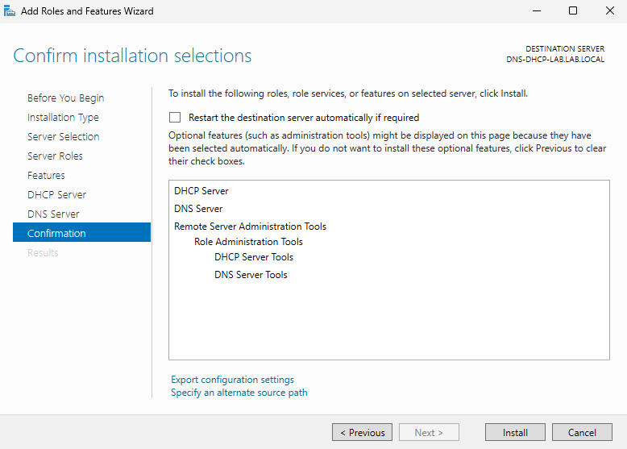

##### DHCP Configuration
1. Once feature installation is complete, select **Complete DHCP Configuration**			!

	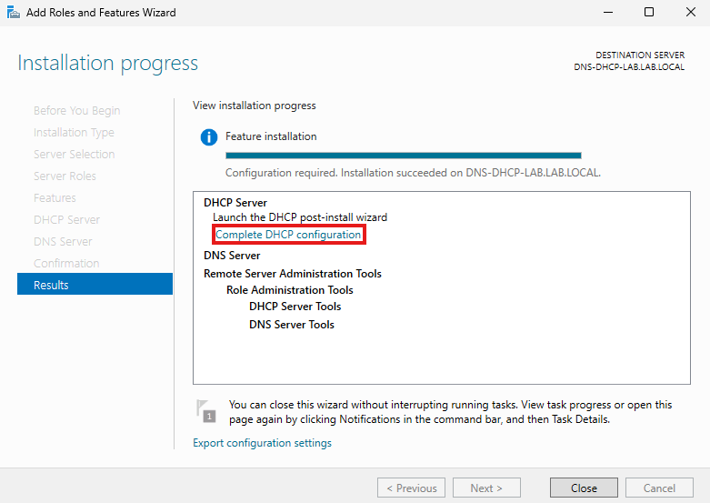
2. Continue with configuration.

	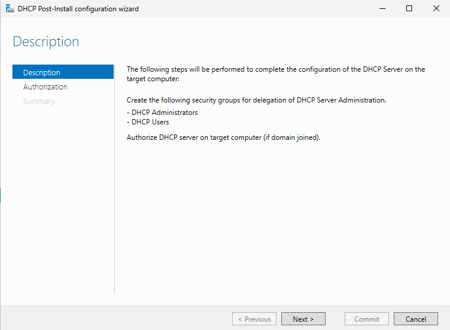
3. **Authorize** DHCP server with an administrator account > Commit

	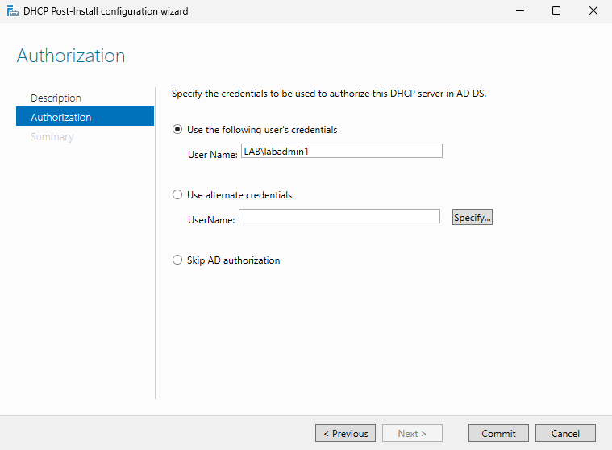
4. Your DHCP server is now configured!

	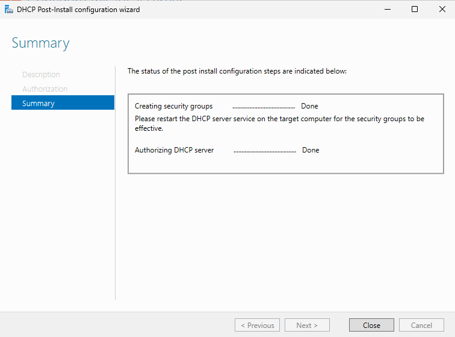
5. Create **DHCP Scope** for **Client IPs** > Open **DHCP** app

	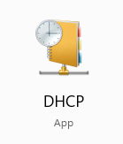
6. Expand path > Right-Click **IPv4** > select **New Scope**

	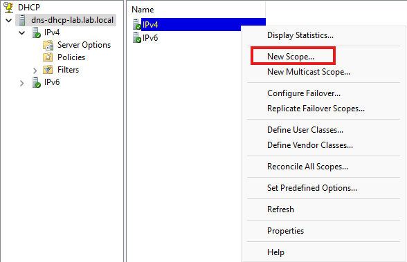
7. Start scope setup

	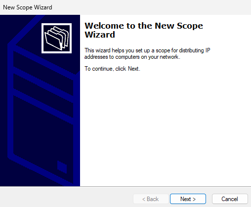
8. Give your scope a name.

	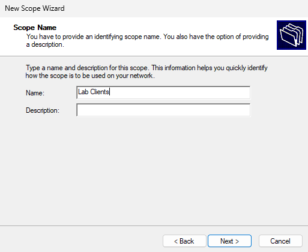
9. Configure the address range and subnet mask

	*Note: Remember to exclude the network address, broadcast address, and the default gateway.*

	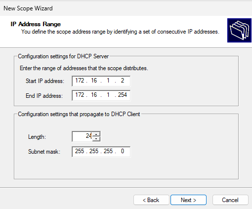
10. We're not configuring **Exclusions/Delay** > Next
11.  Leave **Duration** as default > Next
12. Configure Scope Options

	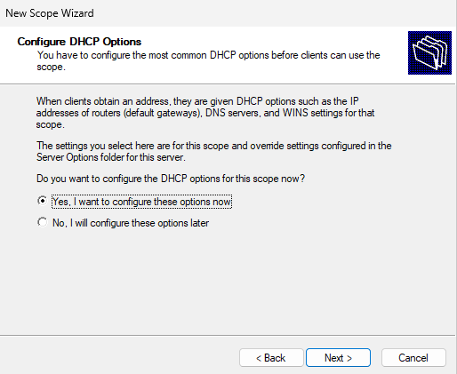
13. Add default gateway for **Client network** (This should be the IP of the interface on the firewall).

	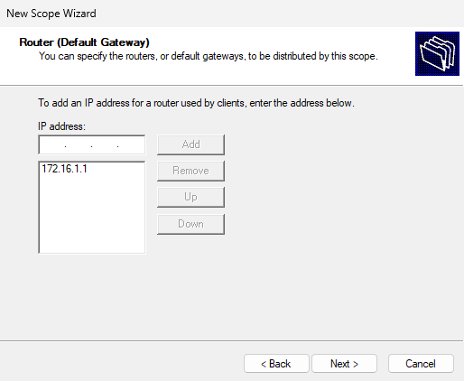
14. Leave **Domain Name** and **DNS Servers** as default > Next

	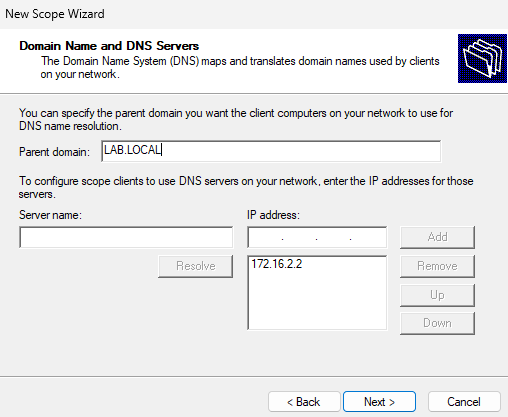
15. We're not configuring a **WINS server** > Next
16. **Activate** the Client scope > Finish

	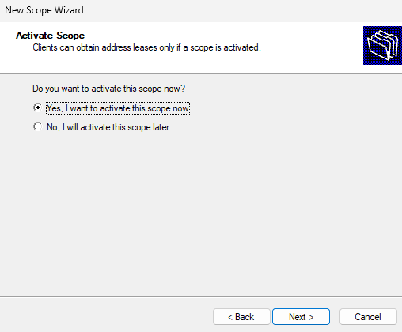
17. You should now have an active scope for **Lab Clients**

	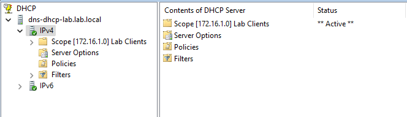

	*Note: We will need to setup a **DHCP Relay** on the **firewall** so the **Client network** can send and receive DHCP requests and replies. This is necessary because the clients that need IPs do not reside within the same network as the DHCP server.*

##### DNS Configuration
1. Configure **Forward Lookup Zones** and **DNS Forwarder** > Open **DNS** app

	*Note: We need a forward lookup zone so domain names can be translated into IP addresses.*
2. Expand path to **Forward Lookup Zones** > Right-click **Forward Lookup Zones**> Select **New Zone**

	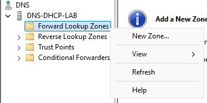
3. Continue with setup > Select **Primary Zone**

	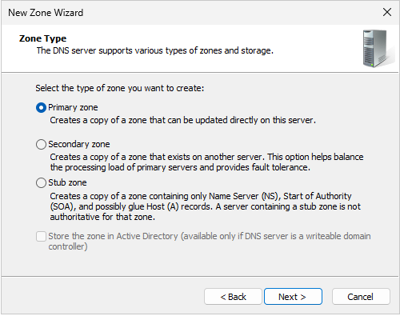
4. Name your new zone > Next

	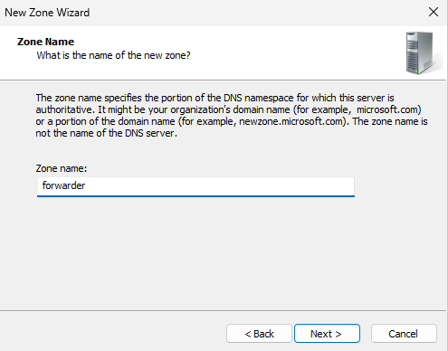
5. Create new file for zone > Next

	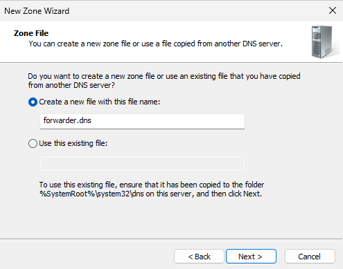
6. **Do not allow dynamic updates** > Next

	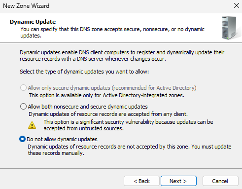
7. Complete setup
8. Click on your DNS Server > Right-click **Forwarders** > **Properties**

	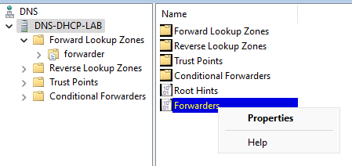
9. Set DNS servers for to resolve DNS queries (if left blank, root hints will be used).

	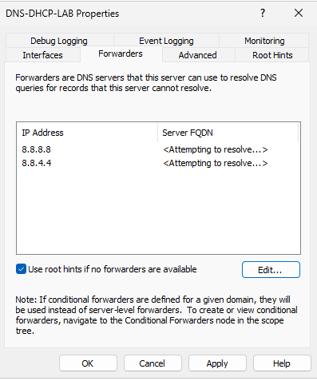

	*Note: The Server FQDN is not resolving yet because we need to create a security policy on the firewall to allow outbound traffic from our servers.*
10. **OK**
