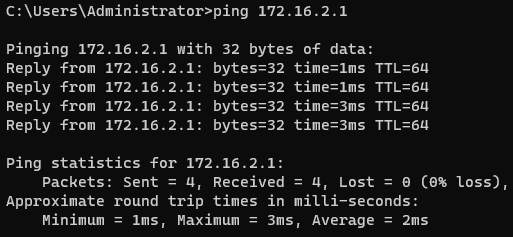
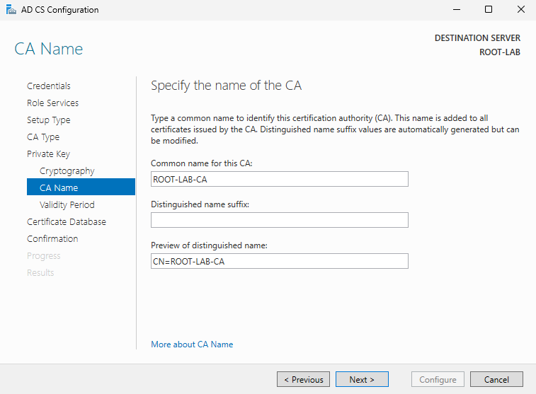
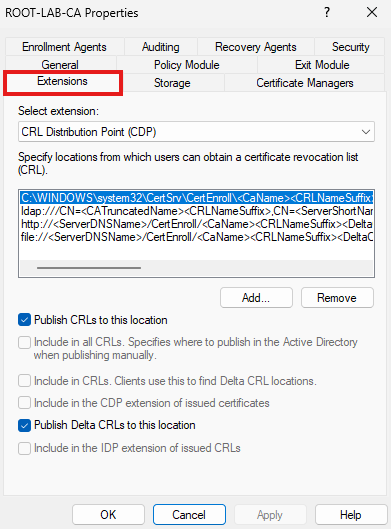
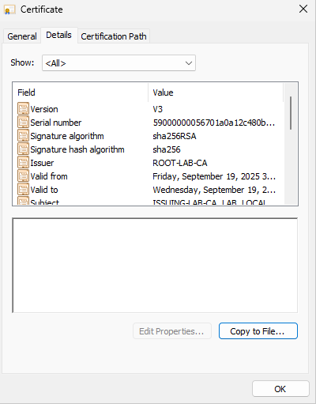
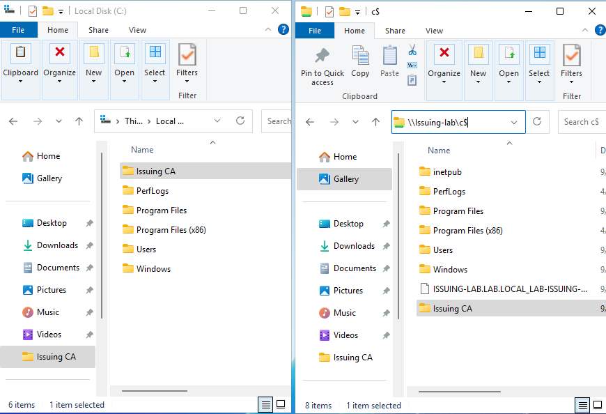
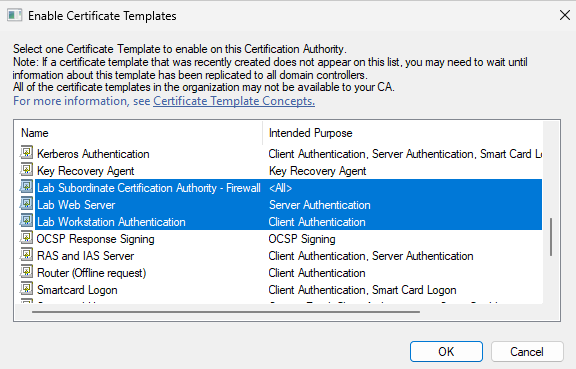
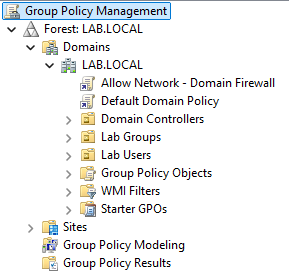
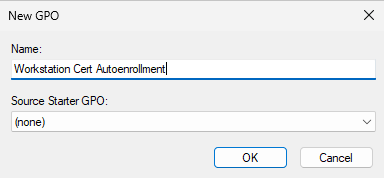

### 6. Deploy Two-Tier PKI

*Note: We'll be configuring ROOT-LAB first, then we'll configure ISSUING-LAB*
##### ROOT-LAB
1. Configure **static IP** and **DNS server** for **ROOT-LAB** in Servers (172.16.2.0/24) subnet.

	*Note: Reference IP Address Plan - ROOT-LAB*
	- IP Address: 172.16.2.4
	- Subnet Mask: 255.255.255.0
	- Default Gateway: 172.16.2.1
	- DNS Server: 172.16.2.2
2. Ensure that you can reach the **Servers gateway** on the **Firewall**.

	
3. Change **computer name** then **Restart**.

	*Note: For security purposes, we will not be joining this server to our domain. It will be a standalone server.*

	
4. Install **Active Directory Certificate Services** (ADCS).
	- Navigate to: **Server Manager** > **Manage** > **Add Roles and Features** > Complete the Wizard
	- Select **Role-base or feature-based installation**

		
	- Select **ROOT-LAB** to install roles and features.

		
	- Select Server Roles > **Active Directory Certificate Services** > Check **Include management tools**.

		

		
	- Leave **Features** as default > Next
	- AD CS > Next
	- Select **Role Services** > Next

		
	- Install **AD CS**

		
5. Configure **AD CS** on **ROOT-LAB**
	- Start configuration.

		
	- **Credentials** > Leave as default > Next 

		
	- Select **Role Services** > Next

		
	- Select **Setup Type** > Standalone CA > Next

		
	- Select **CA Type** > **Root CA** > Next

		
	- **Create a new private key** > Next

		
	- Specify **cryptographic options** > Next

		
	- Specify **CA Name** (left as default)> Next

		
	- Specify **Validity Period** > Next

		
	- Leave **Certificate Database** as default > Next

		
	- Finish Configuration > Close

		

		

		
6. Continue configuration on **Certification Authority**.
	- Open **Certification Authority** app.

		
	- Right-Click your server name > Properties

		
	- In Properties, navigate to **Extensions** tab.

		
	- Add a new **CRL Distribution Point (CDL)**
		- Click **Add** > The location that we will be adding is: `http://certs.lab.local/CertEnroll/<CaName><CRLNameSuffix><DeltaCRLAllowed>.crl`

			*Note: We created a CNAME in DNS on DC-LAB that points certs.lab.local to ISSUING-LAB*

			
		- Ensure both boxes are checked so CDP can be reached on ISSUING-LAB

			

			***Ensure that the http address is added. If not, it will result in errors later in the lab.***
	- Add a new **Authority Information Access (AIA)**
		- Dropdown **Select extension** > Select AIA

			
		- Click **Add** > The location that we will be adding is: `http://certs.lab.local/CertEnroll/<ServerDNSName>_<CaName><CertificateName>.crt`

			
		- Select the following options > **OK**

			

			***Ensure that the http address is added. If not, it will result in errors later in the lab.***
	- Restart **Certification Authority services**
		- After clicking OK, you will be prompted to restart the AD CS service > Yes.

			
7. Change **Certificate Validity** and **CRL Validity** expiration periods.
	- Open **Command Prompt** as an **administrator**

		
	- Change the **CRL Validity** period.

		`certutil -setreg CA\CRLPeriodUnits 20`

		`certutil -setreg CA\CRLPeriod "Years"`

		
	- Change the **Certificate Validity** period.

		`certutil -setreg CA\ValidityPeriodUnits 10`

		`certutil -setreg CA\ValidityPeriod "Years"`

		
	- Restart **certificate services**
		`net stop certsvc`
		`net start certsvc`

		

##### ISSUING-LAB
1. Configure **static IP** and **DNS server** for **ISSUING-LAB** in Servers (172.16.2.0/24) subnet.

	*Note: Reference IP Address Plan - ISSUING-LAB*
	- IP Address: 172.16.2.5
	- Subnet Mask: 255.255.255.0
	- Default Gateway: 172.16.2.1
	- DNS Server: 172.16.2.2
2. Ensure that you can reach the **Servers gateway** on the **Firewall**.

	
3. Change **computer name** and **join LAB.LOCAL domain**, use **labadmin** credentials when prompted, then **Restart**.

	

	

	
	- Once restarted, log in with **labadmin** account.
4. Add a **CNAME** on **DNS** that points to **ISSUING-LAB**
	- Log into **DC-LAB** as a **labadmin**.
	- Open **DNS** app.
	- Expand path to **LAB.LOCAL**

		
	- Right-Click **LAB.LOCAL** > Select **New Alias (CNAME)**

		
	- Set **Alias name** to **certs** and **FQDN** to **ISSUING-LAB.LAB.LOCAL** > OK

		
	- Verify **CNAME** by pinging **certs.lab.local**

		
5. Install **Active Directory Certificate Services** (ADCS).
	 Navigate to Server Manager > Manage > Add Roles and Features > Complete the Wizard
	- Select **Role-base or feature-based installation**

		
	- Select **ISSUING-LAB** to install roles and features.

		
	- Select Server Roles > **Active Directory Certificate Services** > Check **Include management tools**.

		

		
	- Leave **Features** as default > Next
	- AD CS > Next
	- Select **Role Services** > Check **Include Management tools**> Next

		

		
	- Web Server Role (IIS) > Next
	- Role Services, leave as default > Next
	- Install AD CS

		
6. Configure **AD CS** on **ISSUING-LAB**
	- Start configuration.
	
		
	- **Credentials** > Leave as default > Next 

		
	- Select **Role Services** > Next

		
	- Select **Setup Type** > Enterprise CA > Next

		
	- Select **CA Type** > **Subordinate CA** > Next

		
	- **Create a new private key** > Next

		
	- Specify **cryptographic options** > Next

		
	- Specify **CA Name** (left as default)> Next

		
	- Create **Certificate Request** > Next

		*Take note of **where** the certificate request is being saved and under what **name**.*

		
	- Leave **Certificate Database** as default > Next

		
	- Finish Configuration > Close

		

		
7. Obtain an **Issuing CA certificate** by submitting **certificate request** to **Root CA**, which is **ROOT-LAB**.
	- Log into **ROOT-LAB** with administrator account.
	- Open **File Explorer** and navigate to the **Local Disk (C:)**

		
	- Create a new folder > Right-click, New, Folder > Name: **Issuing CA**

		
	- Open a new **File Explorer** window and navigate to **`\\ISSUING-LAB\C$`**

		
	- Copy the **certificate request** and paste it into the newly created **Issuing CA** folder on the **Local Disk (C:)** for **ROOT-LAB**

		

		*Note: Ensure that you do not choose **Paste Shortcut***

		

		
	- Open **Certification Authority** app
	- Right-click your server > **Submit New Request**

		
	- Navigate to `C:\Issuing CA` > Select **certificate request** from **ISSUING-LAB**

		
	- Navigate to **Pending Requests**

		
	- Right-click the request > **All Tasks** > **Issue**

		

		The certificate should be issued now under **Issued Certificates**.
	- Navigate to **Issued Certificates** > Right-click certificate > **Open**

		

		

		*Note: The validity period for the certificate is 10 years because we configured that earlier. Default is typically one year.*
	- Navigate to **Details** tab > **Copy to File**

		
	- Export the certificate to **Issuing CA** folder.

		

		

		

		
8. Copy **Issuing CA** folder to **`\\ISSUING-LAB\C$`**

	Before copying the folder over, we need to copy the CRL from **ROOT-LAB**.
	- On **ROOT-LAB** navigate to **`C:\Windows\System32\CertSrv\CertEnroll`**

		
	- **Copy** the two files > **Paste** into **Issuing CA** folder in **ROOT-LAB**

		
	- **Copy Issuing CA** folder and **Paste** into **`\\ISSUING-LAB\C$`**

		
	- We can now **Power Off** and **secure** **ROOT-LAB** server. All certificates will be issued by **ISSUING-LAB**.
9. On **ISSUING-LAB**, finish **Certification Authority** configuration.
	- Copy **ROOT-LAB** files from **Issuing CA** folder to **`C:\Windows\System32\CertSrv\CertEnroll`** on **ISSUING-LAB**

		

		

		***ENSURE THAT THIS STEP IS COMPLETED BEFORE MOVING ON.***

		*If not completed, you will receive certificate revocation errors.*

		*If you have completed this step, but are still receiving this error then it's possible that either the AIA or CDL, or both, did not contain the correct http address pointing to ISSUING-LAB. If you're pointing to a CNAME, ensure that it's created on DNS.*
	- Open **Certification Authority** app
	- Right-click **CA server** > **All Tasks** > **Install CA Certificate**

		
	- Select **Issuing Certificate** that we placed in the **Issuing CA** folder.

		
	- Right-click CA Server > **Start Service**

		
	- Confirm that the server is up (Green checkmark)

		
10. Edit **Certificate Templates**
	- Expand path to **Certificate Templates**.

		
	- Delete all default templates in the folder.

		*Note: We will be creating/duplicating three templates for the lab.*

		
	- Right-click **Certificate Templates** > Manage

		
	- In the **Certificate Templates Consoles**, **Duplicate** and **Edit** the following templates:
		- Workstation Authentication
			- Right-click template > **Duplicate Template**

				
			- Navigate to **General** tab > **Rename** template duplicate

				
			- Navigate to **Security** tab > Select **Domain Computers** > Select **Allow** for **Autoenroll**

				
			- Click **OK** > Verify **Lab Workstation Authentication** template exists.

				
		- Web Server
			- Right-click template > **Duplicate Template**

				
			- Navigate to **General** tab > **Rename** template duplicate

				
			- Navigate to **Security** tab > Add **ISSUING-LAB**  > Select **Allow** for **Enroll**

				
				- Add **Computers Object Type**

				

				
	
				
			- Click **OK** > Verify **Lab Web Server** template exists.

				
		- Subordinate CA
			- Right-click template > **Duplicate Template**

				
			- Navigate to **General** tab > **Rename** template duplicate

				
			- Click **OK** > Verify **Lab Subordinate Certification Authority - Firewall** template exists.

				*Note: We will be using this template later in the lab to setup SSL Decryption on the firewall.*

				
		- Close out of **Certificate Templates Console**
	- Right-click **Certificate Templates** > **New** > **Certificate Template to Issue**

		
	- Find the duplicated certificate templates > Select > OK

		
	- Verify the certificate templates have been added.

		
11. Issue Web Server certificate for **`certs.lab.local`**
	- On **ISSUING-LAB**, search for **Manage computer certificates** and open > Yes.

		\

		
	- Expand path: Personal > Certificates

		
	- Right-click **Personal** > **All Tasks** > **Request New Certificate**

		
	- Select **Certificate Enrollment Policy** > Next

		
	- Select **Lab Web Server** > Next

		

		*Note: If Lab Web Server doesn't appear, ensure that ISSUING-LAB is allowed to enroll certificates in the Certificate Template Console settings for the Lab Web Server template.*
	- Expand details > Select **Properties**

		
	- Add **Common Name** and **DNS** > OK

		
	- **Enroll** > Finish

		

		
12. Configure **Internet Information Services (IIS) Manger** for **`certs.lab.local`**
	- Open IIS Manager

		
	- Expand **Connections** path to **Default Web Site**

		
	- Right-click **Default Web Site** > Select **Edit Bindings**

		
	- In **Site Bindings** > **Add**

		
	- Change **Type** to **https** and select **certs.lab.local** for **SSL certificate** > OK

		
	- Verify that **`https://certs.lab.local`** shows a secure connection.

		

		*Note: We will be using this site to issue a certificate for the firewall.*

##### DC-LAB
1.  Verify client certificate and **ROOT-LAB-CA** certificate do not exist (I tested this on **DNS-DHCP-LAB** server).
	- Open computer certificates > **Manage computer certificates**

		
	- Open **Personal** folder > Verify that there are no objects.

		
	- Open **Trusted Root Certification Authorities** > **Certificates** folder > Verify that **ROOT-LAB-CA** certificate does not exist.

		
2. Configure **GPO** to push root certificate as a **trusted root CA**.
	- Log in to **DC-LAB** as a **labadmin**.
	- Open **Group Policy Management** app

		
	- Expand path to lab domain.

		
	- Right-Click LAB.LOCAL (or your domain) > Select **Create a GPO in this domain, and Link it here...**

		
	- Name your new GPO > **OK**

		
	- Right-click your newly created GPO > **Edit**

		
	- Expand path to **Trusted Root Certification Authorities**

		
	- Right-click the folder > **Import**

		
	- Open path to Root CA certificate > Open

		
	- Complete import.
3. Verify **Root CA** certificate is present.
	- Log in to **DNS-DHCP-LAB** > Open **Command Prompt** > run **gpupdate /force**

		
	- Open **computer certificates** >**Trusted Root CA**s folder > Verify **ROOT-LAB-CA** is present.

		
4. Configure **GPO auto-enrollment** to push certificates to clients.
	- Log in to **DC-LAB** as a **labadmin**.
	- Open **Group Policy Management** app
	- Expand path to lab domain.

		
	- Right-Click LAB.LOCAL (or your domain) > Select **Create a GPO in this domain, and Link it here...**

		
	- Name your new GPO > OK

		
	- Right-click your newly created GPO > Edit

		
	- Expand path to **Public Key Policies**
 
		
	- Select the **Auto-Enrollment** object type > Right-click > Open Properties

		
	- Enable the policy.

		
	- Check the two options to allow certificate updates > OK

		
5. Verify client certificate was issued.
	 - Log in to **DNS-DHCP-LAB** > Open **Command Prompt** > run **gpupdate /force**

		
	- Open **computer certificates** >**Personal**s folder > Verify client certificate is present.

		

**Completed PKI Setup**

