### 7. Create New Policies, DHCP Relay, and Administrators (via NGFW GUI)
##### Create New Security Policies
The policies that we will be configuring is to allow access from the **Management** zone to the **Servers** zone. Additionally, we'll allow the **Client** zone to reach the **Servers** and **Management** zones. We'll update these policies later with **User-ID**.
1. Log into the firewall GUI with your **host PC**
2. Navigate to **Policies** > **Security**
3. Select the **Management to Palo Alto Updates** rule that we created earlier > **Clone** > **OK**

	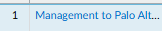

	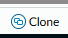

	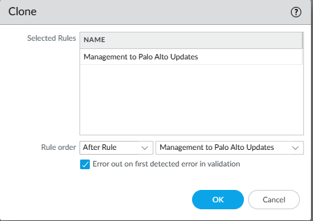
4. Open the newly cloned rule

	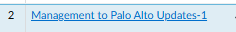
5. Rename the **rule** and change **destination** zone > **OK**

	*This rule will allow the Management to reach our Servers.*

	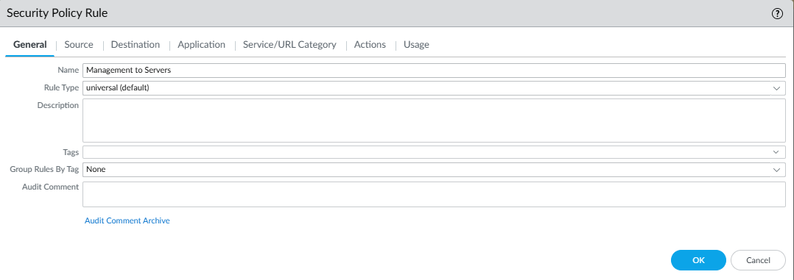

	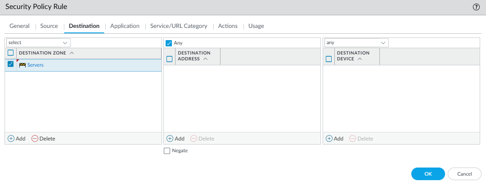
6. **Clone** > Rename **rule**, and change **source** and **destination** zones > OK

	*This rule will be used for Client PCs to reach the Management and Servers zones*

	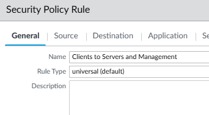

	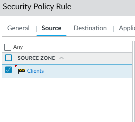

	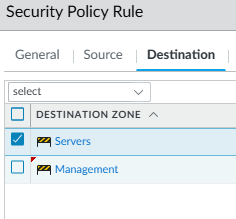
7.  **Clone** > Rename **rule**, and change **source** and **destination** zones > OK

	*This rule will be used for Clients and Servers to reach the Internet.*

	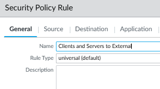

	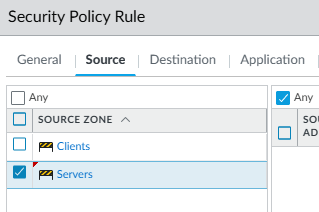

	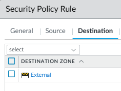
8. Verify rules have been created.

	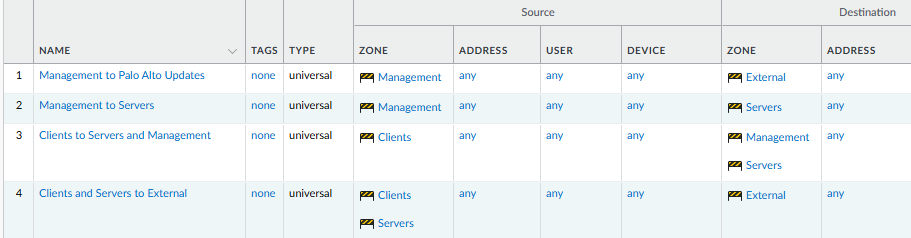
9. **Commit** changes.

##### Configure DHCP Relay
1. Navigate to **Network** > **DHCP** > **DHCP Relay** > **Add**

	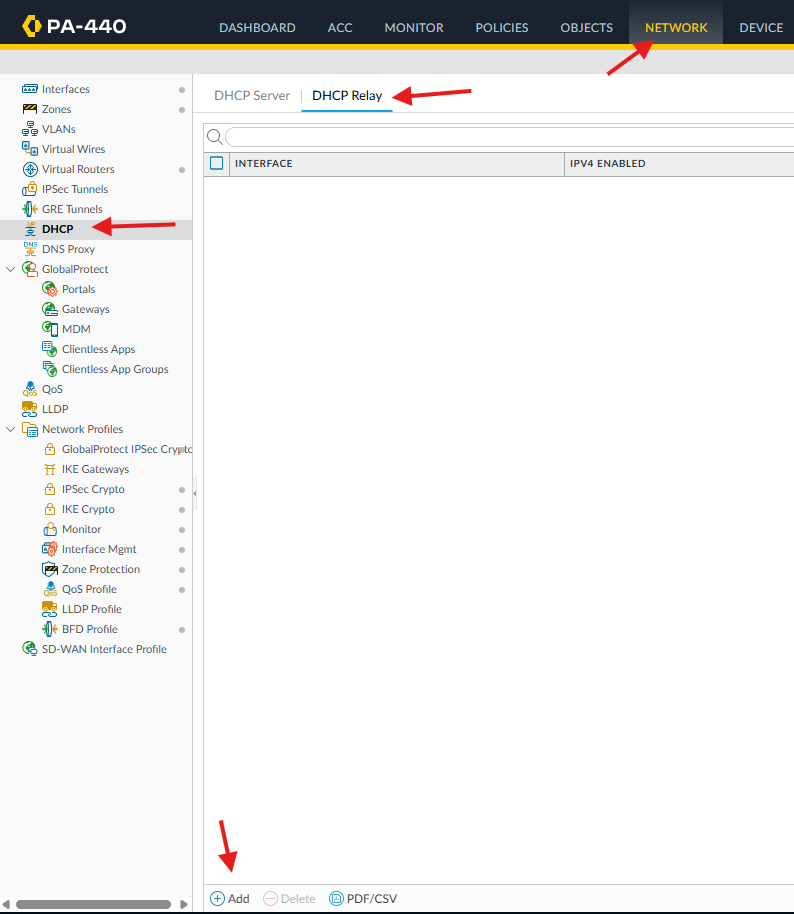
2. Configure the **interface** and **DHCP address** > **OK**

	*Note: The interface will be the Clients interface since that is where the requests will be coming from.*

	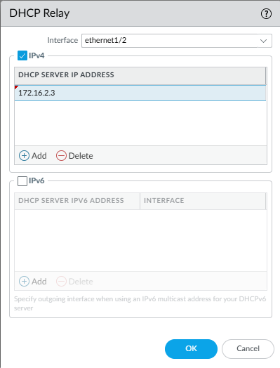
3. **Commit**
4. Verify **DHCP Relay** feature is attached to appropriate interface.

	In Network > Interfaces > Ethernet, the Clients interface should have a DHCP Relay icon in the **Features** section

	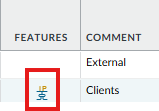

##### Add Administrators to Firewall

We will be configuring **labadmin2** as an administrator on the firewall. Their credentials will authenticate against Active Directory using LDAP. We will use the **Palo Alto service account** that we created earlier to bind to AD.
1. Navigate to **Device** > **Server Profiles** > **LDAP**
	
	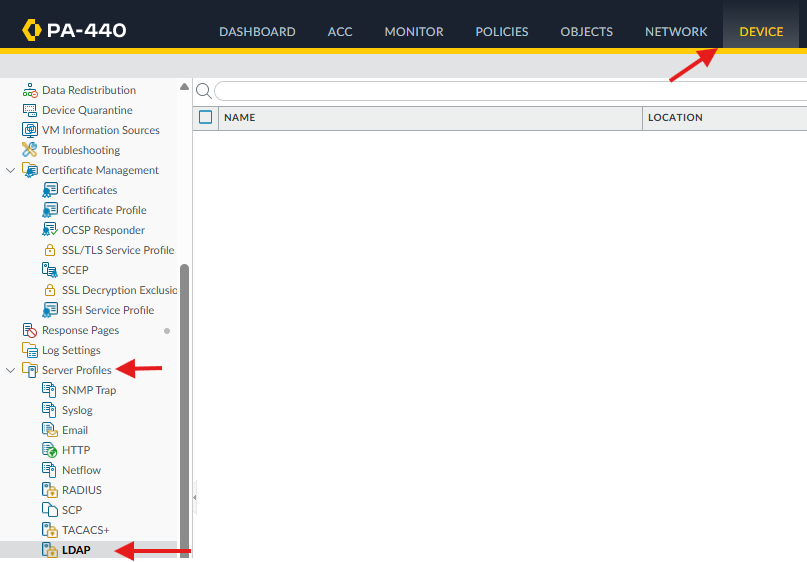
2. **Add** > Configure the following:
	- Profile Name: Lab DC
	- Server List:
		- Name: DC-LAB
		- LDAP Server: 172.16.2.2
	- Type: active-directory
	- Base DN: DC=LAB,DC=LOCAL
	
		You can find this in **DC-LAB** > **AD Users and Computers** > Right-click **Domain** > **Properties** > **Attribute Editor** > **distinguishedName**

		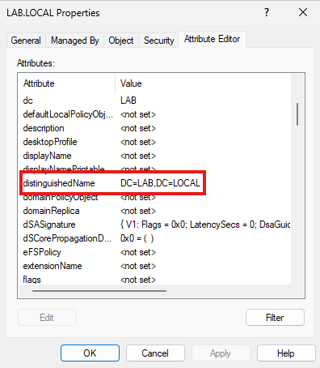

		*Ensure that Advanced Features is enabled to view Attribute Editor tab: View > Advanced Features*

		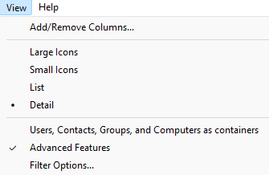
	- Bind DN: paloaltoservice\@lab.local
	- Password: *Service account password*
	- Uncheck SSL/TLS requirement
	
	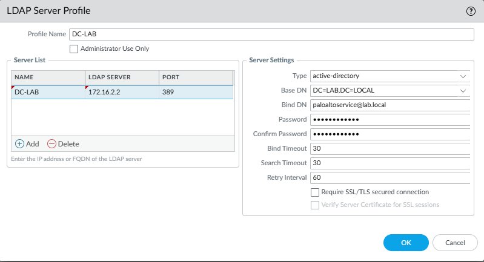
3. **Commit**
4. Verify that LDAP Server Profile works
	-  Navigate to **Device** > **User Identification** > **Group Mapping Settings** > **Add**

		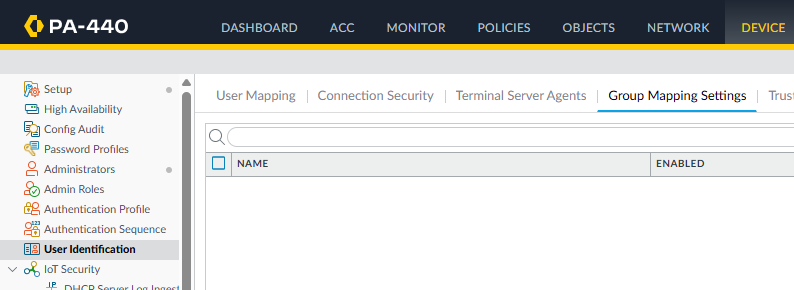
	- Select **Server Profile**

		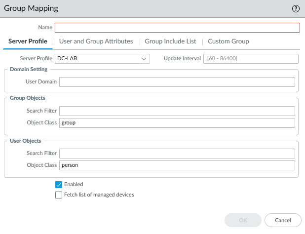
	- Navigate to **Group Include List** > Open **DC=LAB,DC=LOCAL**

		If groups open, the server profile was configured correctly.

		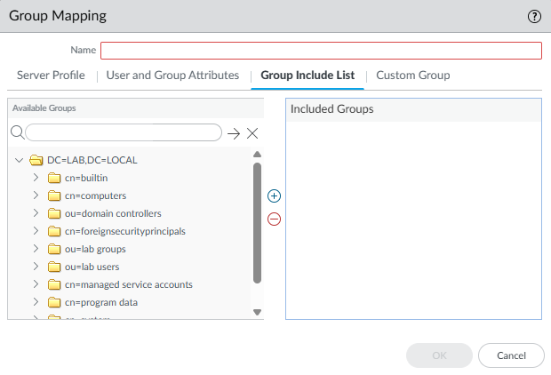

	*Note: If you received the following error, move on to the next step. If you were able to pull retrieve the AD groups, you can skip the next step.*

	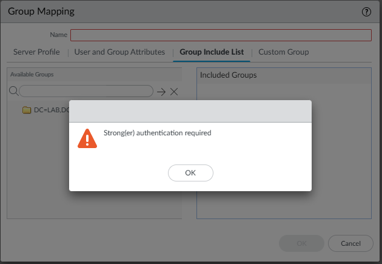
5. *If necessary*, **Troubleshoot** LDAP Server Profile
	- First, ensure that you did commit your newly configure security rules. If not, commit and try verifying that you're able to pull down the AD groups.
	- If you're still having trouble, the issue might be with the domain controller, **DC-LAB**.
		- Log into **DC-LAB** as a lab admin.
		- Open **Local Security Policy**

			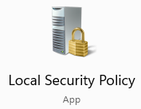
		- Open path: Security Settings > Local Policies > Security Options

			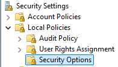
		- Find *Domain Controller: LDAP server signing requirements Enforcement* > Double-click > Disable > OK

			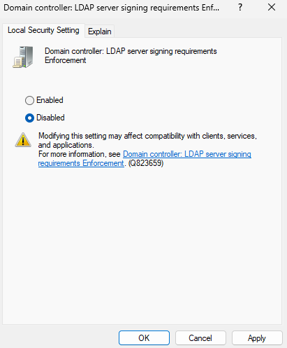
		- Verify if you're able to pull down groups as previously demonstrated.
6. Navigate to **Device** > **Authentication Profile** > **Add** Authentication Profile
	- Name: DC-LAB
	- Authentication
		- Type: LDAP
		- Server Profile: DC-LAB
		- Login Attribute: sAMAccountName
		- User Domain: lab

		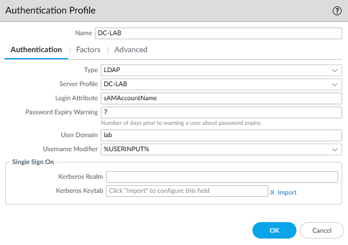
	- Advanced
		- Add > Allow **All**

		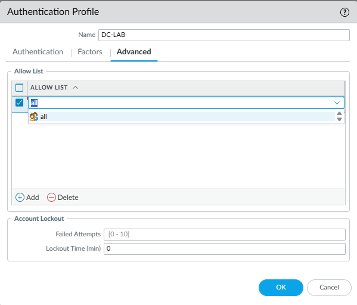
	- OK > **Commit**
7. Navigate to **Device** > **Administrator** > **Add** New **labadmin2** as an **Administrator**
	- Name: use same as AD username - labadmin2
	- Authentication Profile: DC-LAB
	- Administrator Type: Dynamic > Super User
	- OK > **Commit**

	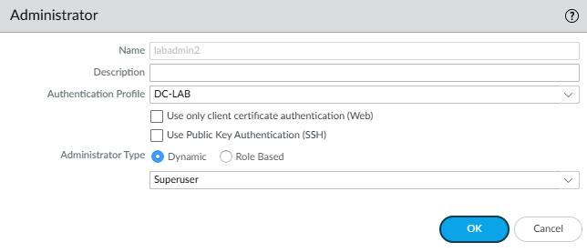
8. Verify that you can log in with newly added **Administrator**
	- Log out of current admin user.
	- Log in with **labadmin2** AD username and password.

		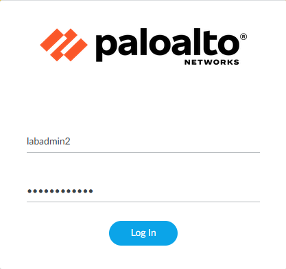
	- If administrative session is created then you have correctly configured everything!

		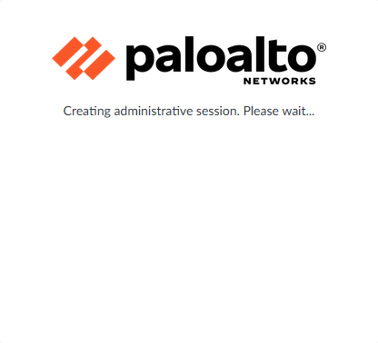
9. Log out

---
### Next Part: [8. Domain Join Clients and Configure Decryption](../8-domain-join-config-decrypt/README.md)
### Previous Part: [6. Deploy Two-Tier PKI](../6-deploy-two-tier-pki/README.md)
