### 8. Domain Join Clients and Configure Decryption
##### Domain Join
1. Power on client virtual machines that were created earlier.
2. Log in to each client with administrator credentials.
3. Confirm **IP address** was configured via **DHCP**
	- Open **Command Prompt** and run `ipconfig /all`

		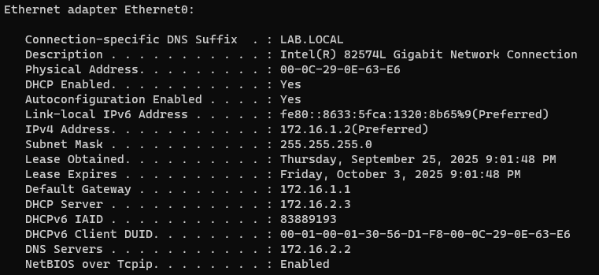
4. Open System Properties > Rename and join lab domain > Restart

	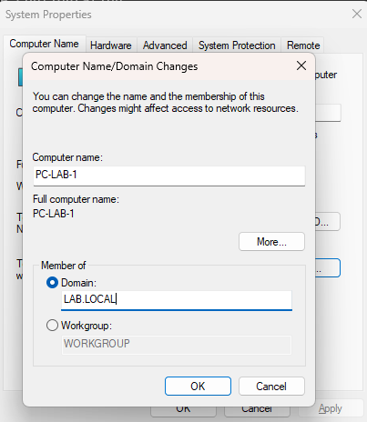

	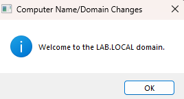
5. Log into either client as **labadmin2** > Move onto next part

	*Note: You can log into both, but only one PC is needed for the next part.*

##### Create Certificates for Decryption

We'll be doing this portion through the Client VM because it will be easier to generate and issue a certificate for decryption.
1. From Client VM, navigate to firewall management: 172.16.3.2

	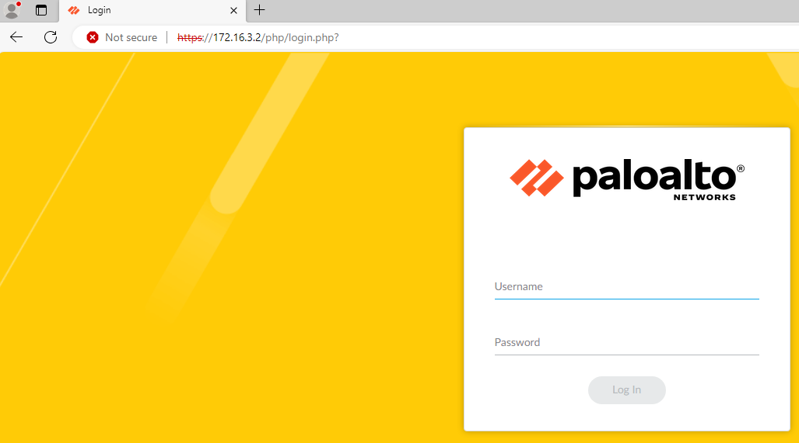
2. Navigate to: **Device** > **Certificate Management** > **Certificates** > **Device Cer**

	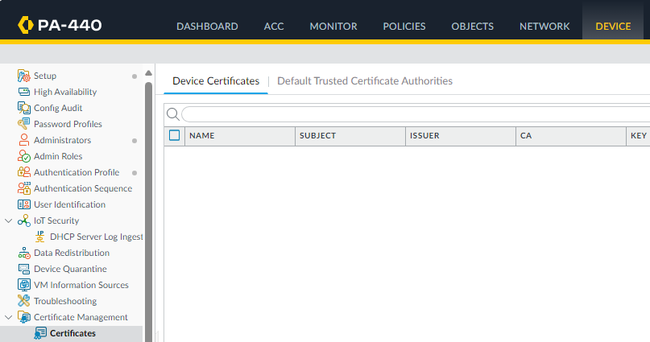
3. Import **Root** and **Issuing** Certificates
	- *Note: You can export the certificates from the client's **Computer Certificates***
		- Open **Manage Computer Certificates**.
		- Navigate to: **Trusted Root Certificate Authorities** and **Intermediate Certification Authorities** > **Certificates**

			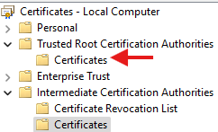

			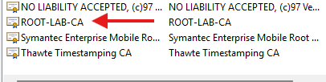

			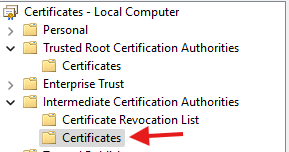

			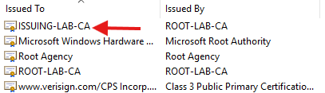
		- Right-click the certificates > All Tasks > Export > Export the certificates as Base-64 format > Save

			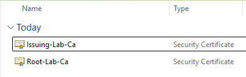
	- Select **Import** > **Name** Certificate > **Browse** and select exported certificate > OK

		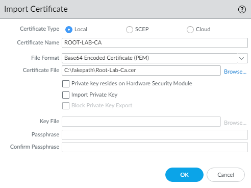
	- After importing, click on certificate > Check **Trusted Root CA** > OK

		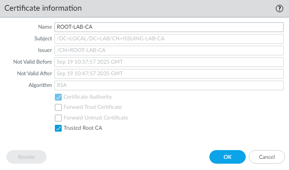
	- **Commit** after both certificates have been imported and trusted.

		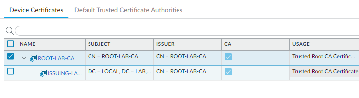
4. Generate certificate for decryption
	-  Click **Generate**

		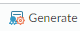
	- Fill out the following then **Generate**:
		- Certificate Name, Common Name, and Signed By

		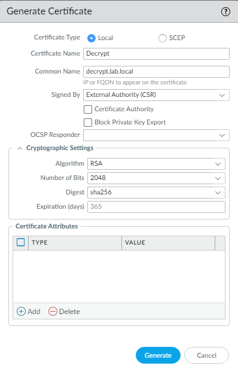
	- The certificate should now be pending > **Select** > **Export Certificate**

		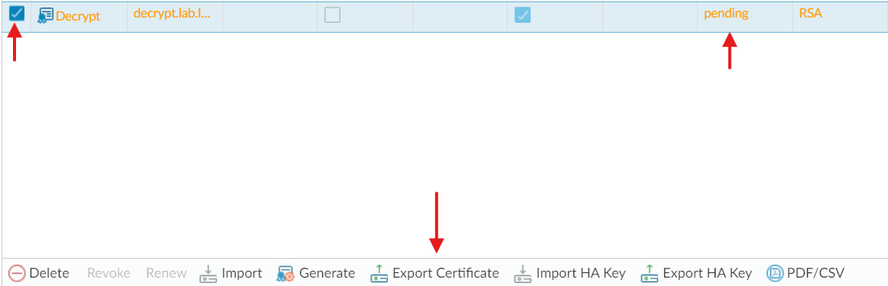
5. Issue the certificate
	- After exporting, open the certificate request in **Notepad** and copy the request.
	- In a web browser, navigate to **https:\//certs.lab.local/certsrv** and log in

		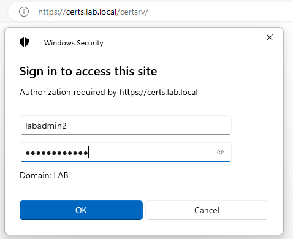
	- Request a certificate > Submit a request > Select Subordinate CA and Paste Request > Submit

		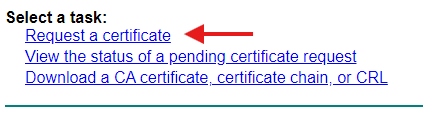

		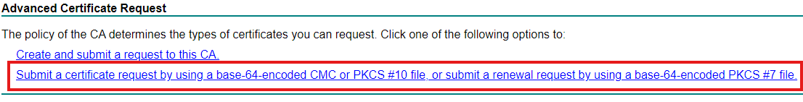

		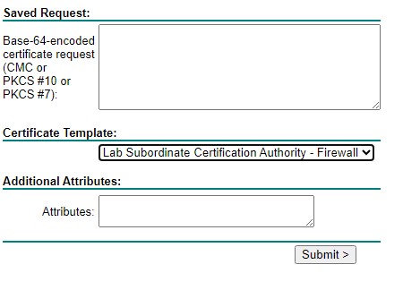
	- Download certificate as Base-64

		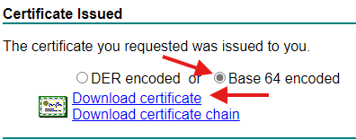
6. Import Signed decryption certificate
	- Select **Import** and select the issued certificate > OK

		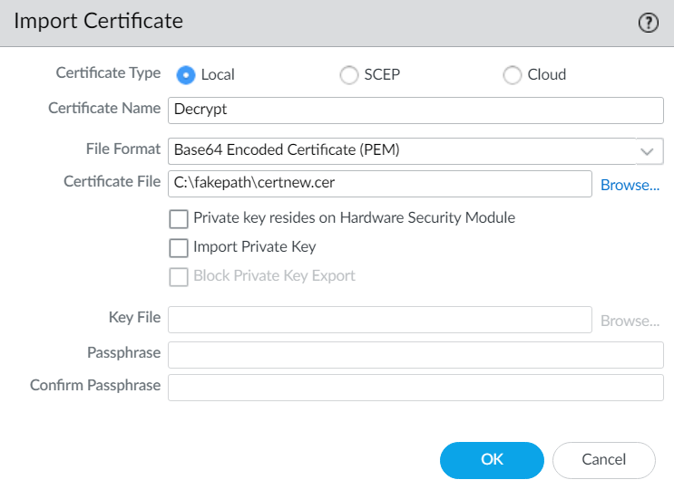
	- The certificate should no longer be pending

		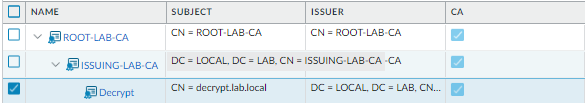
	- Select decrypt certificate and check **Forward Trust Certificate** > **OK**

		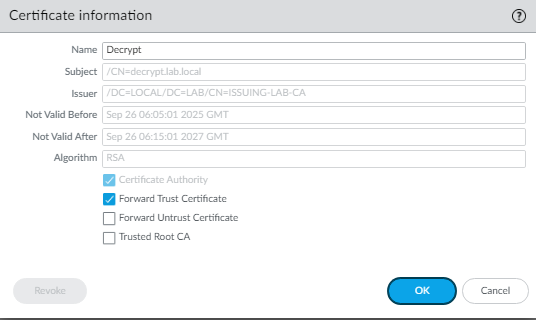
7. Generate certificate for **Forward Untrust**
	- Click **Generate**
	- Fill out the following then **Generate**:
		- Certificate Name, Common Name, Check CA

			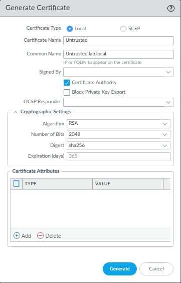
	- Select the certificate and check **Forward Untrust Certificate** > **OK**

		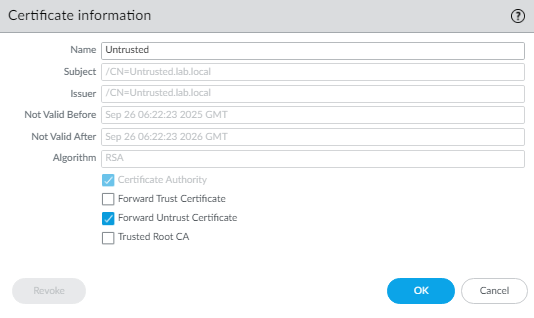
8. Verify certificates

	You should now have four imported certificates.

	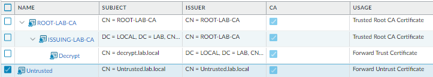
9. **Commit**

##### Create Decryption Policies
1. Create a **Decryption Profile**

	We will be applying this profile to a **Decryption Policy**.
	- Navigate to **Objects** >**Decryption** > **Decryption Profile** > **Add**
	- Configure the following:
		Name; SSL Decryption - SSL Forward Proxy and SSL Protocol Settings; No Decryption

		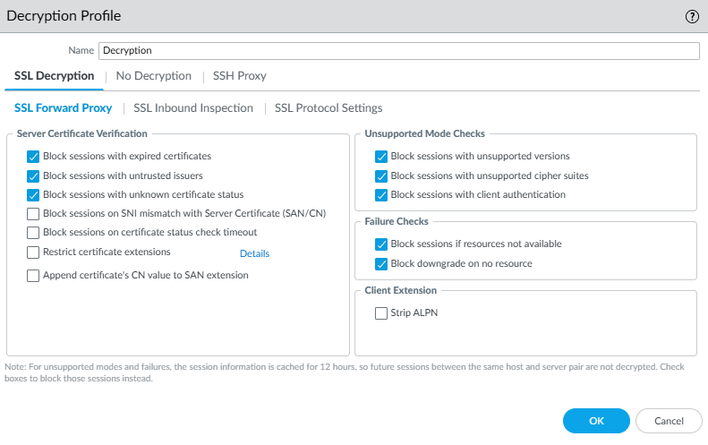

		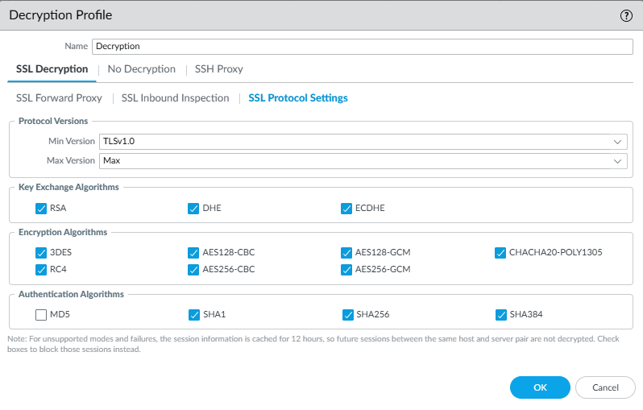

		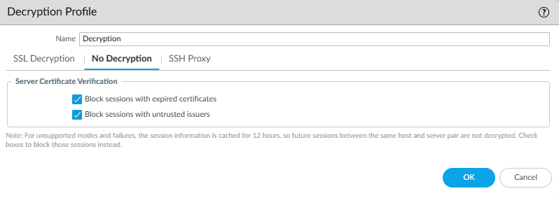
	- **OK**
2. Create a **URL Category** object.

	This object will be used to not decrypt specific traffic.
	- Navigate to **Objects** > **Custom Objects** > **URL Category** > **Add**
	- Configure the following:

		Name; Type: Category Match; Categories

		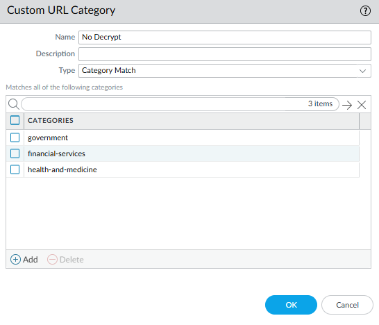
3. Create a **Decryption Exclusion** policy.
	- Navigate to: **Policies** > **Decryption** > **Add**
	- Configure the following:
		- Name

			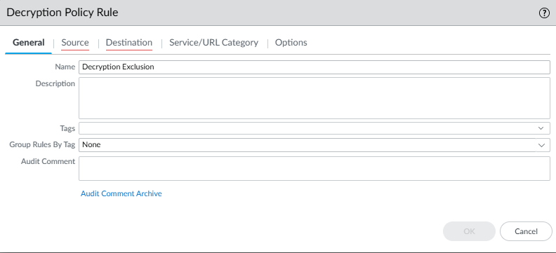
		- Source

			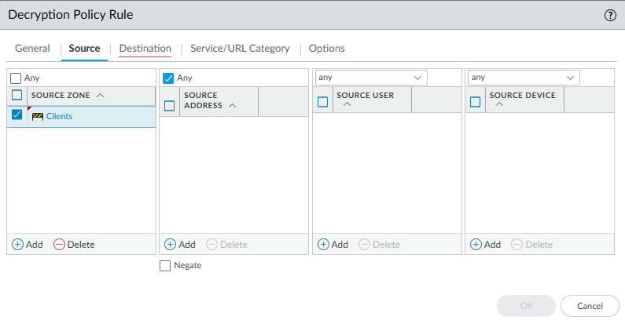
		- Destination

			
		- Service/URL Category

			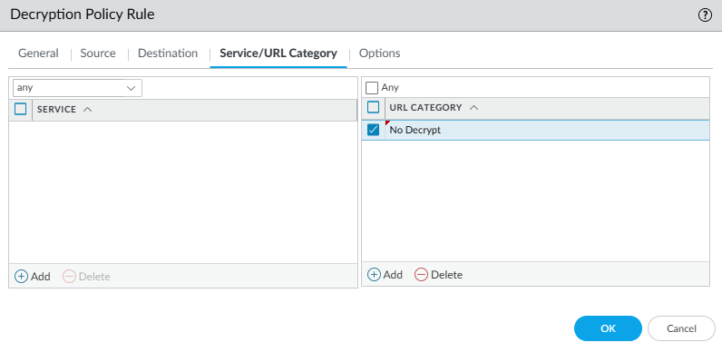
		- Options

			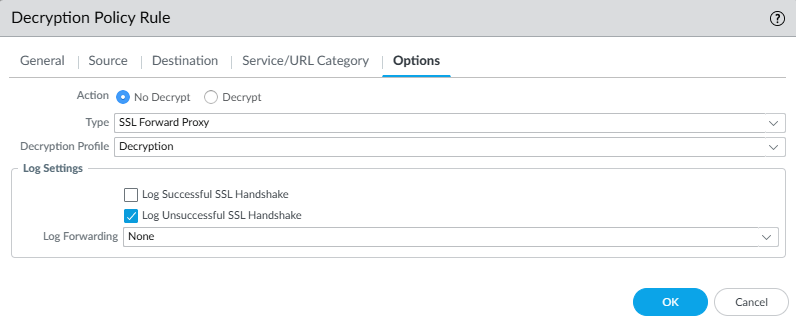
	- **OK**
4. Create a **Decryption** policy.
	- Navigate to: **Policies** > **Decryption** > **Add**
	- Configure the following:
		- Name

			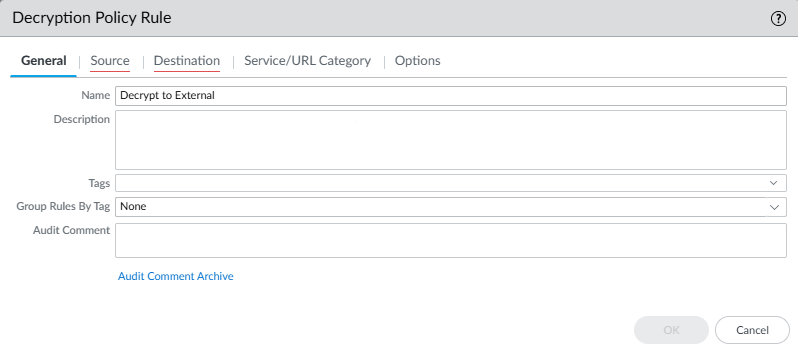
		- Source

			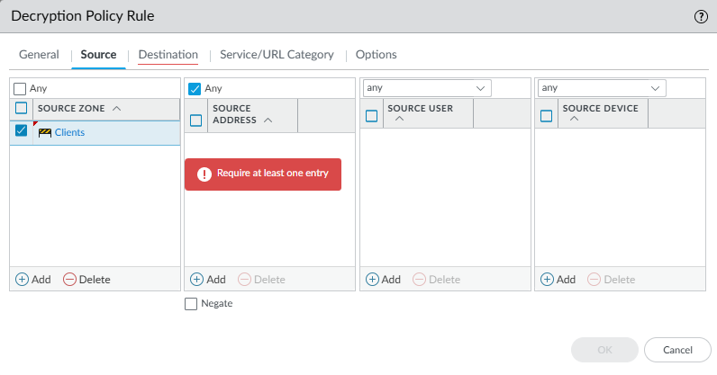
		- Destination

			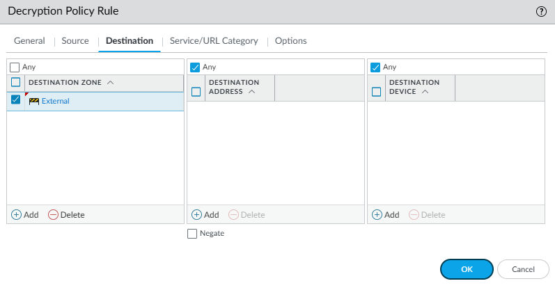
		- Service/URL Category

			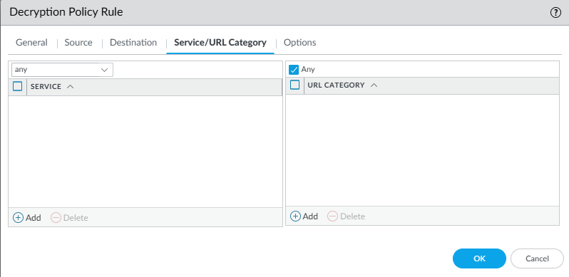
		- Options

			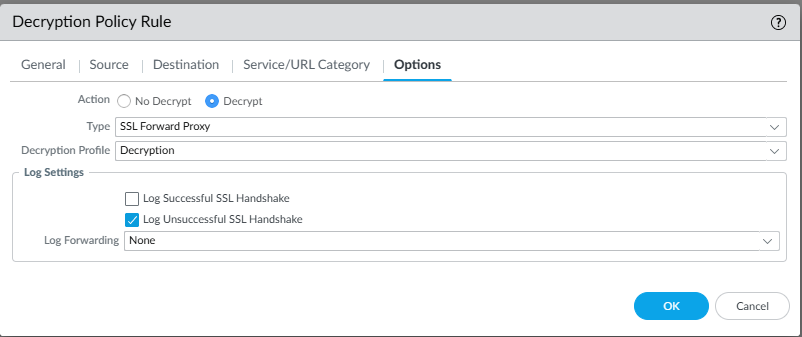
	- **OK**
5. **Check policies** and **Commit**
	- Ensure that the policies are in the following order:

		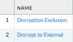

##### Verify Traffic Decryption
1. Verify decryption with browser certificate.
	- In your lab client, open a web browser and navigate to any website (I browsed to yahoo.com).
	- Open the site certificate

		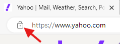

		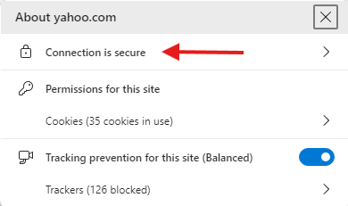

		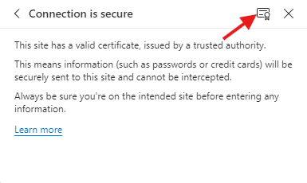

		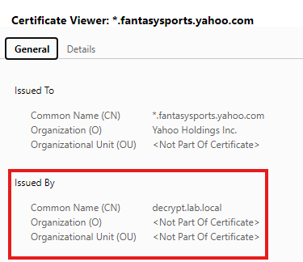

	The traffic has been **decrypted** and was issued the **Forward Trust** certificate.
2. Verify with **Traffic** logs.
	- Navigate to: **Monitor** > **Traffic**
	- Use the following filter: `( addr.src in 172.16.1.2 ) and ( port eq 443 ) and ( zone.dst eq 'External' )`

		We're searching for traffic originating from 172.16.1.2 (**PC-LAB-1**) that is going to the **External** zone through port **443**.
	- Open any log

		
	- Ensure the **Decrypted** is checked in the **Flags** section

		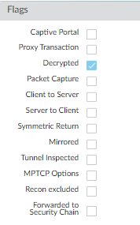
3. Verify **Decryption Profile**

	Since the profile 
	- In your lab clients, open a web browser and navigate to badssl.com.
	- Test **expired** and **untrusted-root**

		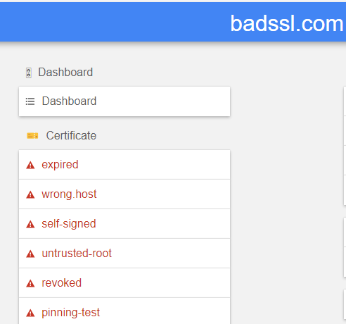
	- You should receive the following errors if your profile was configured correctly:
	
		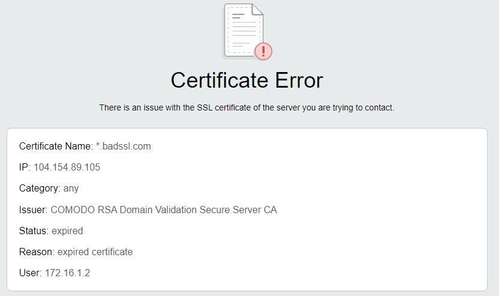
	
		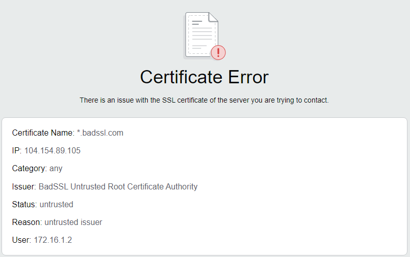

