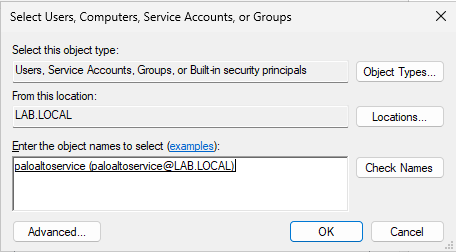

### 9. Deploy Windows User-ID Agent
##### UID-LAB
1. Configure and Domain-join **UID-LAB**
	- Configure IP address, netmask, gateway, and DNS server.

		
	- Rename and domain join server.

		
2. Download and install the **Windows User-ID Agent**
	- Download the User Identification Agent; it can be found on the [Support Portal](https://support.paloaltonetworks.com/); it will be under Updates > Software Updates > User Identification Agent.
	- Install **User-ID Agent** that you downloaded.

		

		
3. Add **paloaltoservice** as service account.
	- Open **Local Security Policy**
	- Navigate to: **Local Policies** > **User Rights Assessment** > **Log on as a service** > Open **Properties**

		
	- Select **Add User or Group** > Add **paloaltoservice** > **OK**

		

		
4. Add **paloaltoservice** as a **Local Administrator**
	- Open **Edit local users and groups**

		
	- Navigate to: **Groups** > **Administrators**

		
	- Right-click **Administrators** > **Properties** > **Add paloaltoservice** account.

		

		
5. Configure **User-ID Agent** on **UID-LAB**
	- Open **User-ID Agent** as **administrator**.

		
	- Navigate to: **User Identification** > **Setup** > **Edit**

		
	- Add **paloaltoservice** and **password** > **OK**

		
	- **Save** and **Commit**

		
	- Navigate to: **User Identification** > **Setup** > **Discovery** > **Auto Discover**

		
	- Once **domain controller** has been discovered > **Save** and **Commit**
	- Navigate to **User Identification** tab > **Agent Status** should now be *Agent is running.*

		

##### NGFW GUI
1. Configure a Security Policy for Management to reach User-ID Windows Agent

	While building out the lab, there was a connectivity issue between the firewall and User-ID agent. After creating this rule, the problem was resolved. This rule needs to be above the **Management to Servers** rule.
	- Navigate to **Policies** > **Security** > **Add**
	- Configure the following:
		- Name: Management to UID-LAB
		- Source: **Management** zone, **IP**: 172.16.3.2

			
		- Destination: **Servers** zone, **IP**: 172.16.2.6

			
		- Application: paloalto-userid-agent

			
		- Service/URL Category: default
		- Actions: Allow

			
		- **OK**
	- Ensure that the rule is above **Management to Servers**

		You can use the **Move** option at the bottom of the page or drag and drop the rule. 

		
2. Configure **Agent Settings**
	- On firewall, navigate to: **Device** > **Data Redistribution** > **Add**

		
	- Configure the following:

		Name, Host and Port, Data Type

		
	- **OK** > **Commit**
3. Verify connectivity.
	- After the configuration commits, the Data Redistribution Agent that we just added should now show **Connected: yes**

		

---
### Next Part: [10. Configure Identity-Based Firewall Policies](../10-config-id-policies/README.md)
### Previous Part: [8. Domain Join Clients and Configure Decryption](../8-domain-join-config-decrypt/README.md)
